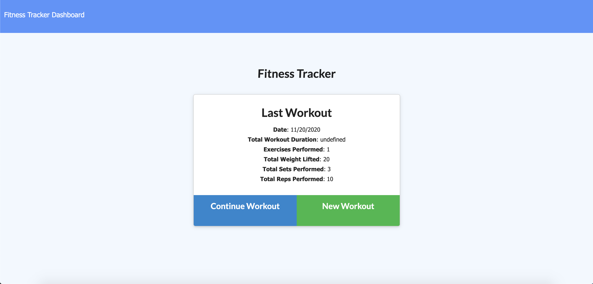
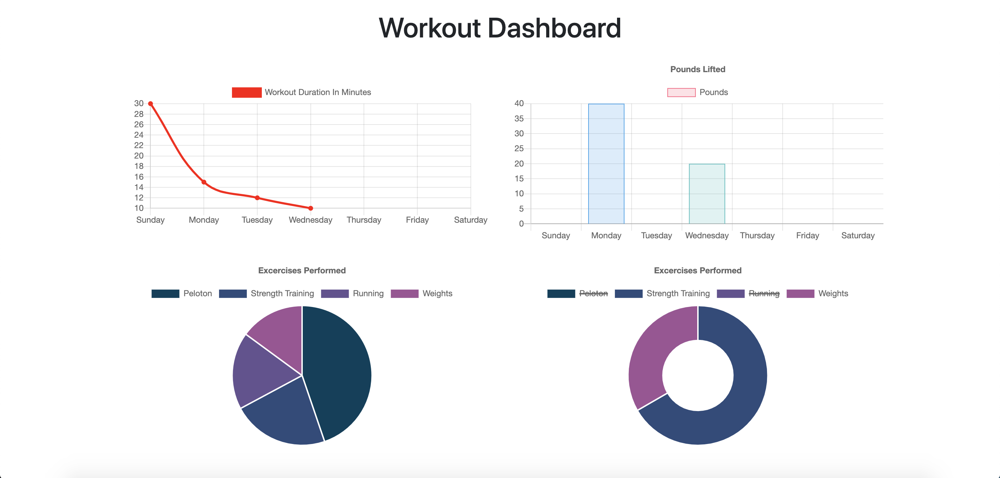

# Workout Tracker

<h2>Overview</h2>

**Deployed Site:** https://kd-workout-tracker.herokuapp.com/

**Technologies Used:** Node.js, Express, MongoDB, Mongoose, Morgan, Heroku, HTML, CSS

**Contact:** <a href="mailto:kayla.dunphe@gmail.com">kayla.dunphe@gmail.com</a>

**Goal:** Create a workout tracker with a dashboard to track progress.

<h2>Screenshots</h2>

